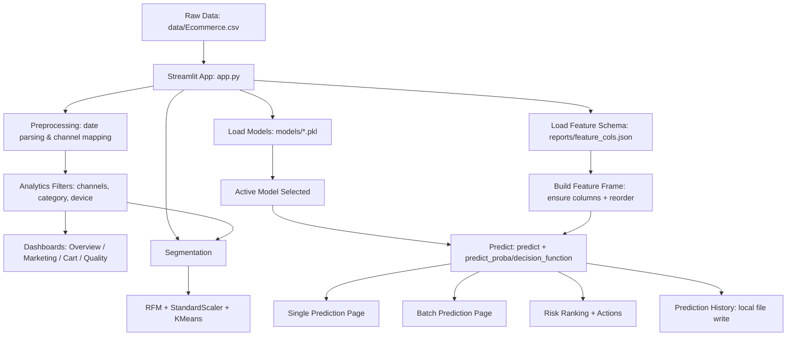

# Customer Segmentation & Retention Analysis in E-commerce using Machine Learning (CSRA Dashboard)

A complete end-to-end data science + ML project that analyzes customer behavior in an e-commerce dataset, builds churn/retention prediction models (session-level + customer-level), performs segmentation (RFM + KMeans), and deploys an interactive **Streamlit dashboard** for analytics, prediction, and recommendations.

---

## 🚀 Live Demo

**[▶ Open the deployed app](https://customer-segmentation-and-retention-analysis-using-machine-lea.streamlit.app/)**

> [https://customer-segmentation-and-retention-analysis-using-machine-lea.streamlit.app/]

---

## Live App (Streamlit)
Deploy this repository on **Streamlit Community Cloud** with:

- **Repository:** `Shivanshthenerd/Customer-Segmentation-Retention-Analysis-using-Machine-Learning`
- **Branch:** `main`
- **Main file:** `app.py`

---

## Project Highlights
- **Behavior analytics**: revenue, conversion, abandonment, marketing channel performance
- **Churn prediction**:
  - single customer prediction
  - batch scoring
  - threshold sweep + ROC-AUC
  - error analysis (FP/FN)
- **Customer segmentation**: RFM engineering + KMeans clustering
- **Recommendations**:
  - category-level and product-level recommendations based on popularity + user history
- **Explainability**:
  - feature importance table + business interpretation
- **Deployment-ready**:
  - Streamlit app with caching, interactive controls, and clean UI

---

## Repository Structure

```text
.
├─ app.py
├─ requirements.txt
├─ .gitignore
├─ data/
│  └─ Ecommerce.csv
├─ models/
│  ├─ best_customer_model.pkl
│  └─ best_session_model.pkl
├─ notebooks/
│  ├─ eda.ipynb
│  ├─ cart_abandonment.ipynb
│  ├─ marketing_analysis.ipynb
│  ├─ recommendation_system.ipynb
│  └─ catboost_info/                # training logs/artifacts (from CatBoost)
└─ reports/
   ├─ feature_cols.json
   ├─ session_metrics.csv
   ├─ customer_metrics.csv
   ├─ feature_importance.csv
   ├─ case_list.csv
   ├─ marketing_conversion.csv
   ├─ marketing_abandonment.csv
   ├─ marketing_revenue.csv
   ├─ popular_products.csv
   └─ segment_results.csv
```

### What each folder means
- **`data/`**: Raw dataset used by the Streamlit app and notebooks.
- **`models/`**: Trained ML models serialized as `.pkl` (CatBoost/XGBoost/Sklearn pipeline objects).
- **`notebooks/`**: Research notebooks used for EDA, feature engineering, training, analysis, and recommendations.
- **`reports/`**: Saved results used by the Streamlit app (metrics, feature schema, feature importance, and other exports).

---

## App Pipeline (End-to-End)

### 1) Data Loading
The app reads raw data from:

- `data/Ecommerce.csv`

In `app.py`, the data is loaded and lightly standardized:
- parse `visit_date` (if present)
- map `marketing_channel` numeric codes to readable names (if present)

### 2) Optional Processed Dataset
The app supports an optional processed dataset (feature table), if present:

- `data/processed/customer_features_phase1.csv` *(optional)*

If it’s missing, the dashboard still runs, but some advanced evaluation features (like churn label analysis) may be limited.

### 3) Model Loading
Models are loaded from:

- `models/*.pkl`

The sidebar lets you choose:
- upload a `.pkl` model (optional)
- or select from saved models in the repository

The app infers whether the model is:
- **session-level**
- **customer-level**
based on the model name (`session` / `customer` keywords).

### 4) Feature Schema Alignment
To avoid column mismatch, the app uses:

- `reports/feature_cols.json`

It stores a schema such as:
- `session_level_features`
- `customer_level_features`

During prediction:
- missing features are created and set to 0
- columns are reordered to exactly match expected feature order

### 5) Predictions
For a selected model:
- `predict()` is used for labels
- probability is derived from:
  - `predict_proba()` if available
  - else `decision_function()` (converted using sigmoid)
  - else fallback to predicted class as probability

Predictions are converted into:
- **risk band**: Low / Watch / Medium / High
- **recommended action**: reminder / coupon / VIP call, etc.

### 6) Business Analytics + Visualization
The app computes and visualizes:
- revenue by category
- conversion by channel
- cart abandonment
- segmentation plot (RFM clusters)
- top risk customers with revenue-at-risk proxy
- recommendations based on purchase popularity

---

## Project Pipeline Flowchart

The diagram below is always visible as plain text. A richer interactive version is included underneath for supported viewers.

### Pipeline Overview (ASCII — always visible on GitHub)

```
+---------------------------+
|  data/Ecommerce.csv       |  <-- Raw data source
+---------------------------+
              |
              v
+---------------------------+
|  app.py  (Streamlit)      |  <-- Entry point
+---------------------------+
     |         |         |
     v         v         v
+------------+ +------------+ +------------------------+
| Preprocess | | Load       | | Load Feature Schema    |
| (dates,    | | Models     | | reports/feature_cols   |
| channels)  | | models/    | | .json                  |
|            | | *.pkl      | | (col order + names)    |
+------------+ +------------+ +------------------------+
     |             |               |
     v             v               v
+----------+  +---------+  +-------------------+
| Analytics|  | Active  |  | Build Feature     |
| Filters  |  | Model   |  | Frame             |
| (channel,|  |(session |  |(add missing cols, |
|  device, |  | or      |  | reorder to schema)|
|  category|  | customer|  +-------------------+
+----------+  +---------+          |
     |              |              |
     v              +--------------+
+---------------------+           |
| Dashboards          |           v
| - Overview          |  +---------------------+
| - Marketing Insights|  | Predict()           |
| - Cart Analysis     |  | predict_proba() /   |
| - Data Quality      |  | decision_function() |
+---------------------+  +---------------------+
     |                            |
     |          +-----------------+-----------------+
     |          |        |        |                 |
     |          v        v        v                 v
     |   +--------+ +-------+ +--------+  +------------------+
     |   | Single | | Batch | | Risk   |  | Prediction       |
     |   | Predict| |Predict| | Ranking|  | History          |
     |   +--------+ +-------+ | +Actns |  | (local CSV file) |
     |                        +--------+  +------------------+
     |
     v
+-------------------------------------+
| Segmentation                        |
| RFM Engineering --> StandardScaler  |
| --> KMeans Clustering --> Plot      |
+-------------------------------------+
```

### Interactive Diagram (Mermaid — renders on GitHub and mermaid.live)

> **Note:** GitHub renders Mermaid diagrams natively. If the diagram below does not display in your viewer, paste it into **[https://mermaid.live](https://mermaid.live)** to view or export it as an image.



---

## Dashboard Pages (What you can demonstrate)
Your Streamlit app includes these pages:
- **Overview**: executive KPIs + revenue by category + recent rows
- **Research Summary**: best model selection, threshold sweep, ROC-AUC, error analysis, ablation study
- **Predict (Single)**: interactively edit key fields and predict churn probability
- **Batch Prediction**: upload CSV → get predictions + download results
- **Prediction History**: view all saved predictions (note: not persistent on Streamlit Cloud)
- **Model Comparison**: compare model metrics and view feature importance
- **Risk Ranking**: prioritize customers by churn probability / revenue-at-risk
- **Recommendations**: recommend categories/products based on history + popularity
- **Marketing Insights**: conversion + abandonment by channel
- **Cart Analysis**: cart abandonment breakdowns
- **Segmentation**: RFM + KMeans cluster visualization
- **Data Quality**: missing values + datatypes
- **Final Verdict**: selects best model based on F1
- **Explainability**: feature importance + business interpretation

---

## How to Run Locally

### 1) Create an environment (recommended)
```bash
python -m venv .venv
# Windows
.venv\Scripts\activate
# macOS/Linux
source .venv/bin/activate
```

### 2) Install dependencies
```bash
pip install -r requirements.txt
```

### 3) Run the app
```bash
streamlit run app.py
```

---

## Model Notes (CatBoost / XGBoost)
This repo contains `.pkl` models in `models/`. Since you mentioned CatBoost/XGBoost were used:

- Make sure `requirements.txt` contains:
  - `catboost`
  - `xgboost`

If you ever see errors like `ModuleNotFoundError: catboost` on Streamlit Cloud, it means the dependency was not installed and must be added to `requirements.txt`.

---

## Data Notes
- The application **requires**: `data/Ecommerce.csv`
- On Linux (Streamlit Cloud), filenames are **case-sensitive**.
  - Keep the exact casing consistent with `app.py` (currently `Ecommerce.csv`).

---

## Limitations / Known Deployment Behavior
### Prediction History Persistence
The app writes history to a local file:
- `data/prediction_history.csv`

On Streamlit Community Cloud, local file writes are **not reliably persistent** across restarts/redeploys.
If you need persistence, replace history storage with:
- SQLite (sometimes works but still risky on Cloud)
- Google Sheets
- Supabase / Firebase / PostgreSQL
- S3 / GCS object storage

---

## Future Improvements (Suggested)
- Add SHAP / LIME explainability for model outputs
- Add model versioning and metadata (training date, dataset version, features hash)
- Replace local file history with a persistent DB
- Add CI checks (linting, basic unit tests, data schema validation)
- Add dataset provenance + data dictionary

---

## Credits
Developed by **Shivansh Dwivedi** (GitHub: `Shivanshthenerd`)

---
